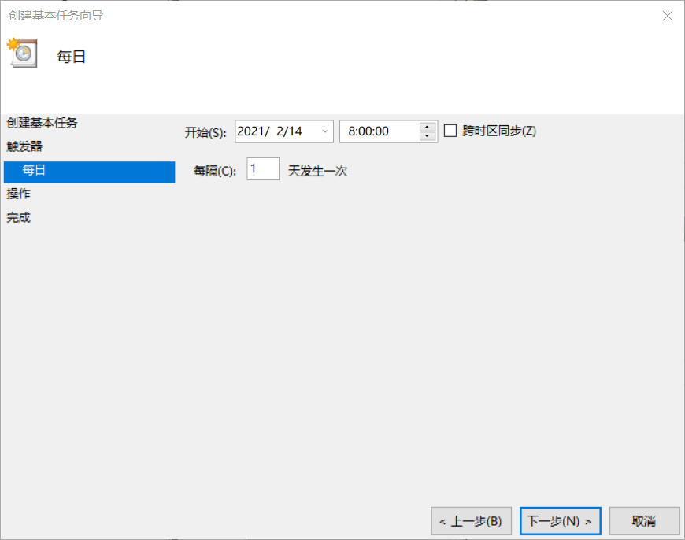

#  *本项目已废除，仅供学习和参考*
#  **仅供学习和参考，所负法律责任与本人无关！请根据实际情况申报！**


# ssti_automatic declaration

#### 介绍
深圳技师学院微信公众号疫情自动申报

#### 原理
使用Fiddler抓取疫情申报所需参数，之后使用python requests模块进行模拟微信客户端发送数据到疫情申报服务端。


#### 安装教程


```
pip install requests
```


1.下载fiddler 打开微信PC客户端，监听微信客户端


2.点击申报页面抓取信息


3.复制所需参数


复制CurrentEnUserCode的参数之后修改python文件中的参数


复制itToken的参数修改python文件中的itToken


使用请仔细查看python文件中的注释


### windows使用以及linux使用

#### windows使用定时任务

按下Win+R调出运行

输入taskschd.msc 打开任务计划程序

点击右侧创建基本任务

填入名称及描述

触发器设置为每天执行

并将开始时间设置为合适的时间

例如我设置的8点，就要保证每天8点电脑处于开机状态




#### linux使用定时任务

网上查询crontab